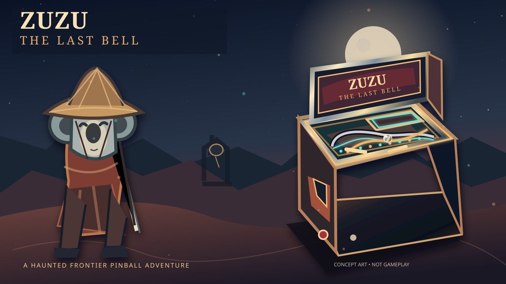
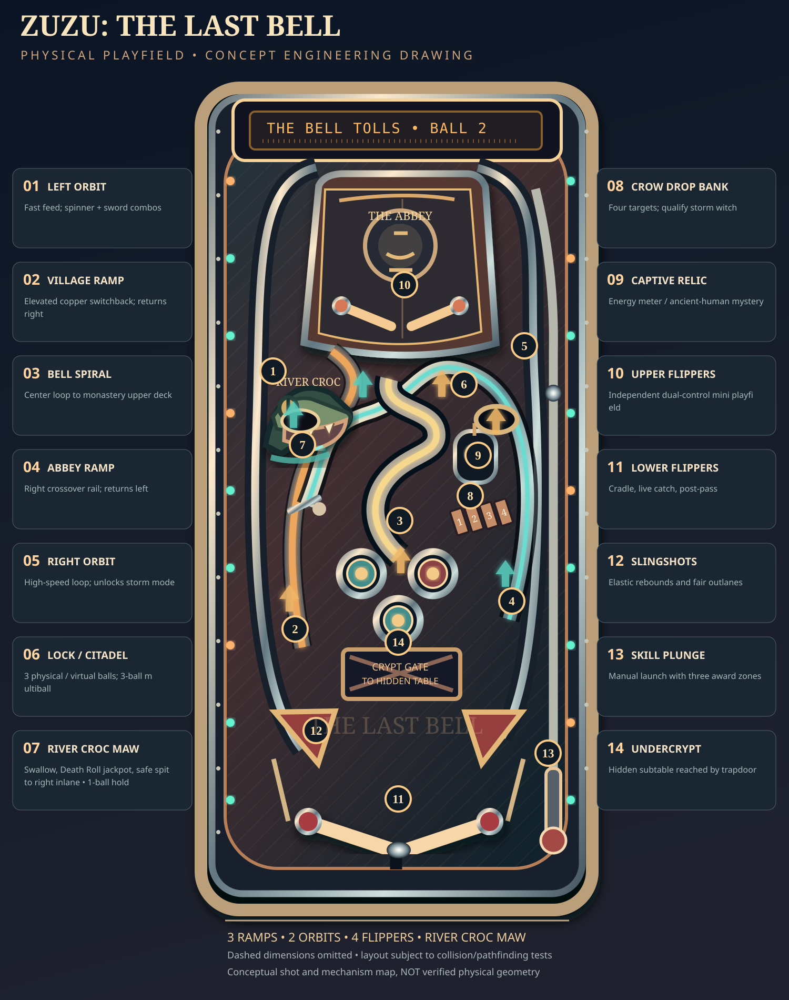
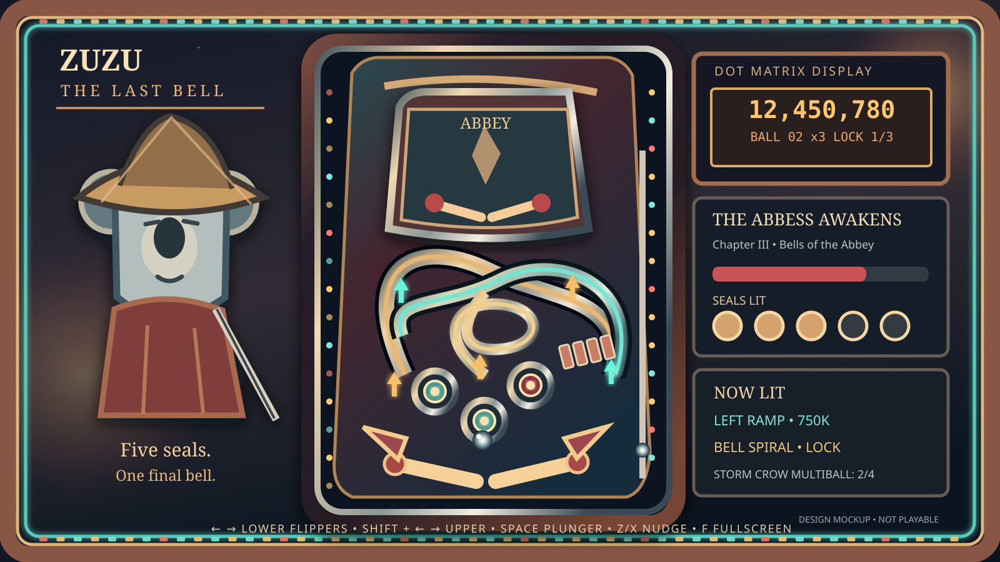
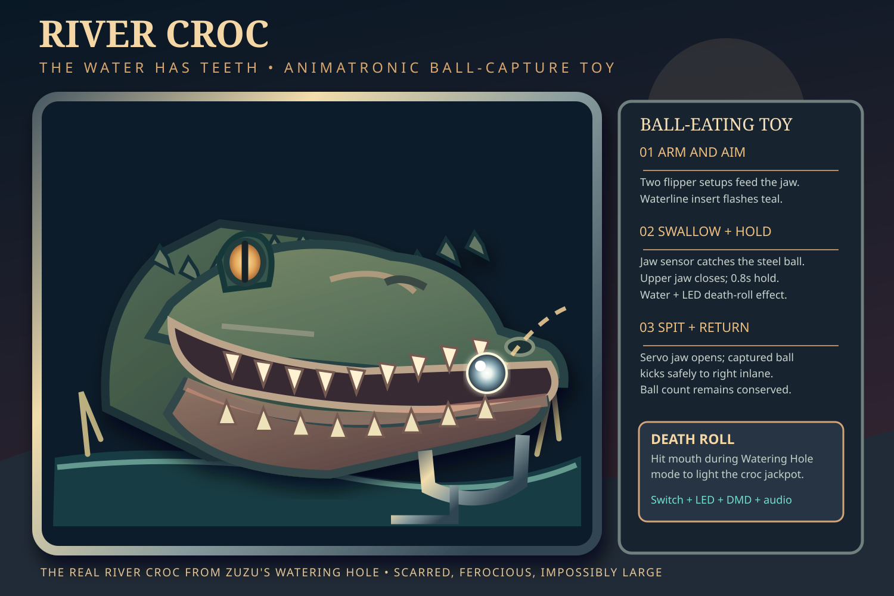

# Zuzu: The Last Bell | Table design brief

**Project:** `zuzu-pinball` · **Date:** 2026-10-09 PT · **Status:** production design, not implemented gameplay

## The pitch

A premium, physically credible **single original pinball table** set in the Zuzu universe. A wandering Edo-era koala ronin enters a dying weird-west frontier village. An abbey's bell keeps ringing even though nobody pulls the rope. The Abbess is harvesting children to feed an ancient hunger. A hidden undercrypt reveals hints of the world that preceded the animal civilizations.

This is a new standalone game in the Kind Robots Arcade, **not** an AMI Village Rescue skin and **not** a change of scope for `kind-pinball`. Reuse the shared Three.js/Rapier physics, input, score, sound, DMD, and cabinet shell where appropriate. Each game owns its **own level geometry, collision bodies, art, mechanisms, shot maps, rules, audio, tests and leaderboard**. Do not reuse an existing table by merely swapping textures.

The target is the quality and depth of a very good *Pinball FX3* table, measured by mechanical feel, original design, replayability, readability, sound and finish, **not** by copying any FX3 IP, machine artwork, geometry, rules implementation or proprietary assets.

## Visual direction | Weird-west lacquer and haunted brass

- An Edo straw hat and chipped katana contrasted with frontier cedar, copper wireforms, moonlit sage, cemetery iron and abbey bells.
- Rich backglass portrait of Zuzu at the outer edge of a burning dusk landscape; silhouette readable when the table is thumbnail-sized.
- Layered dark-green/oxblood printed playfield, raised brass rails, PBR chrome ball, lacquered flippers and warm **addressable LED** strips around the inner cabinet and outer splash/bezel border.
- A restrained lighting grammar: **amber = harvest/village**, **cyan = sword/skill combo**, **red = Abbess/ritual**, **violet = hidden pre-human mystery**, **white = ball save / navigation**. A shot's award state is readable while every decorative lamp is animating.
- Physically model plastics, wireforms, posts, transparent ramps, 3D targets, ramps at different elevations, rubbers and a visible ball trough. Table camera can briefly orbit on mode changes and then return to a latency-safe playing view.
- Signature mechanisms: a **swinging Abbey Bell** target with synchronized sound, the **River Croc** animatronic that swallows and spits out the steel ball, and a **crypt trapdoor** that opens a separate hidden subtable. The crypt is not just a graphic overlaid on the main table.

## Mechanics: a credible single table

The engineering SVG is an annotated **design mockup**, not a verified collision mesh or already implemented game. Model tabletop coordinates, inclined gravity and upper deck clearance before finalizing ramp entrances.

| # | Shot/mechanism | Physical action and rules use |
| --- | --- | --- |
| 01 | Left orbit | Full-depth high-speed loop, spinner; sword combo and traversal |
| 02 | Village left ramp | Elevated copper switchback; returns to **right** lower flipper |
| 03 | Center bell spiral | Spiral entrance to elevated **Abbey upper playfield** |
| 04 | Abbey right ramp | Elevated wireform crossover; returns to **left** lower flipper |
| 05 | Right orbit | Fast loop; storm charge and repeated combo lane |
| 06 | Citadel lock | Lock up to **three** balls; safe virtual lock fallback for devices |
| 07 | **River Croc's mouth** | Shoot the steel ball **between his teeth**, trigger a jaw-close/capture sensor, hold briefly, then controlled eject to the **right inlane**. A lit Death Roll shot grants a croc jackpot; this replaces the original left-side scoop as a much stronger story toy. |
| 08 | Storm Crow drops | Four independently resetting drop targets |
| 09 | Captive relic ball | Stationary metal ball strike, accumulator for ancient-world mystery |
| 10 | Upper flippers | **Two independently controlled** flippers on a visible raised mini-playfield; direct ball transitions back to main deck |
| 11 | Lower flippers | Two full-length player-controlled flippers with cradle, live catch, post-pass and controlled drop-catch |
| 12 | Slings/inlanes | Correct elastic sling response, two kickouts, calibrated outlane difficulty |
| 13 | Manual skill launch | Spring/plunger charge with 3 skill-shot destinations, full shooter-lane gate |
| 14 | Crypt trapdoor | Earned portal to a self-contained **hidden undercrypt mini-table** and return to primary playfield |

Additional assemblies: a separate **right-hand Mortuary scoop** for narrative mode selection, **three pop bumpers**, orbit spinner, two ball-save kickbacks, rollover lanes, outlane danger lamps, magnets only where purposefully integrated, player-adjustable nudge/tilt bob, drain sensor, ball trough, serve coil, switch debouncing, transparent rails and glass reflections.

**Three distinct ramps, two complete orbits, four simultaneously usable flippers across two elevations, and a hidden third play environment** are hard minimums. The hidden undercrypt earns a separate rules scene but counts as part of the same game/table and leaderboard.

### River Croc: a real shootable toy, not just an animated head

The Croc is the enormous, scarred watering-hole predator from Zuzu's existing Book One/gamebook and Showdown canon. His defining motion is **Submerge → Erupt → Death Roll**. The sculpture emerges from a murky left-bank water channel, close enough to be a deliberate lower-flipper shot, with an intimidating open jaw and a clearly marked ball-sized capture throat. Art reference: `RIVER-CROC-TOY-CONCEPT.svg`. Maintain the established River Croc character rather than inventing a generic crocodile mascot.

- **Physical geometry:** the mouth is a generous but aimable scoop entrance, accessible from a controlled flipper shot, with an unobstructed elevated ramp crossing above or behind it. Geometry and ball radius determine the exact mesh, not the illustration. The mouth is visibly open while armed and its **teal waterline insert** lights the route.
- **Toy cycle:** `SUBMERGED → RISING → MOUTH_OPEN → CAPTURED → DEATH_ROLL → SPIT → RESET`; jaw open/close is driven by a deterministic animation and a capture switch. On capture, the ball occupies a real or simulated **one-ball hold**, and the shared trough/ball-count ledger knows where it is. The body writhes, amber eyes flash, water spray/LED effects ripple around the border and a bassy jaw snap plays.
- **Return:** the throat kicker spits the same ball to the **right inlane**, safely and predictably, never directly to a drain. A timed emergency eject, switch debounce and machine-specific ball search prevent softlocks when animation or sensor events stall. Ignore redundant mouth events while already holding a ball; during multiball, other balls remain in play.
- **Rules:** an ordinary unlit swallow earns a small 'SPIT OUT' award and right-inlane setup. During **Watering Hole** story mode, hit the mouth after a qualifying orbit within the combo timer for a **Death Roll jackpot**. Repeated successful shots advance Croc vs Coyote mode and may qualify an extra-ball/light insert. Special DMD close-up of the jaws and splash callout, with an accessible reduced-motion alternative. The Croc is **not** a separate destructive drain, and shooting his mouth must always pay something.
- **QA:** test misses and near misses (teeth should not eat side hits), validated approach angles, jaw collider phases, ramp crossing clearance, mouth shot during 3/4/6-ball play, capture and spit restoring correct ball count, tilt during hold, mode transition during capture, and repeated animation/collision resource cleanup. Trace at least 1,000 deterministic capture/release iterations before accepting it.

### Multiball and depth

- **3-ball Harvest Moon**: lock three balls at Citadel; village and Abbey ramps light staggered jackpots, orbit combos collect super jackpot.
- **4-ball Storm Crow**: complete drop-bank and orbit sequence; animated crow storm, lane-specific jackpot ladders and timed switches.
- **6-ball The Last Bell**: late wizard mode once story seals are complete, using physical/virtual locks and scripted trough serving. Six-ball intensity only when simulated correctly, with automated stuck-ball recovery and performant rendering.
- **Five main story chapters:** Homestead in Ash, Storm Crow Canyon, Abbey of Hollow Bells, The Children's Names, and The Last Bell. A **Watering Hole / River Croc** mini-mode within the Homestead chapter recreates the early Croc encounter without disrupting the five-seal ladder. Modes alter shots, light maps and DMD imagery. The player can continue scoring without reading story beats.
- **Core scoring:** skill launch, lane combos, drop bank completion, spell/sword accumulators, chapter completion, outlane rescue, end-of-ball bonus and multiplier, extra ball, match and high-score initials.
- **Progress memory:** illuminated five-seal progress track, chapter status and boss/ritual phase carried across balls in a game. Losing a ball is not a narrative reset.
- **Hidden discovery:** the crypt opens on a mechanical combo and story condition; undercrypt includes 2 small flippers, its own targets, and an exit kicker returning the ball to main play. Its discovery should be a surprise in gameplay, not a secret in GitHub docs.

### Flipper and nudge mapping

Desktop: left/right arrows (lower pair), Shift+left/right (upper pair) with accessibility option to mirror upper pair automatically, Space to launch, Z/X or directional tilt for nudge, F fullscreen. Gamepad triggers lower; bumpers upper; stick nudge. Touch: large edge pads near thumb positions, upper controls accessible without covering ball/lanes; haptics where supported. Respect reduced motion, mute, contrast, and camera-lock settings.

A casual player should manage lower flippers with only two buttons; advanced players independently control upper flippers. No control may obscure critical shot targets on phone.

## Visual deliverables and technical workflow

1. **Concept art**: `CONCEPT-ART.svg` is an authored vector **directional illustration** of mood and cabinet, not a claimed final photoreal render. Replace with 3D rendered key art and true project icon/card/hero assets via durable art pipeline.
2. **River Croc toy concept**: `RIVER-CROC-TOY-CONCEPT.svg` illustrates the physical mouth catch, jaw mechanism, ball hold and spit-out return, alongside the intended character treatment. It is conceptual mechanical art, not tested jaw/physics geometry.
3. **Player-facing screen mockup**: `GAMEPLAY-SCREEN-MOCKUP.svg` illustrates the LED splash border, separate DMD, lit shot callouts, progress HUD and visible double-level playfield; this is *not* a real screenshot or playable scene.
4. **Mechanical layout mockup**: `PLAYFIELD-MOCKUP.svg` shows labeled shots, ramp routes, mini deck, flippers and ball serve. **It is not a tested physical layout.** Convert it into measured world coordinates, then prove all lanes with simulation before art-lock.
5. **Playable graybox**: use a fresh Arcade game id (proposed `zuzu-pinball`), under an **admin-only preview** `/admin/zuzu-pinball` with visible Admin nav entry, while keeping `/play/zuzu-pinball` unpublished until explicit approval. Share engine APIs with Kind Pinball; do not fork simulation logic gratuitously.
6. **Game-grade scene**: calibrated camera perspective, dynamic contact lights, quality shadow budgets, PBR materials, layered cabinet side/border splash art, full DMD animation, callouts/music, coherent shootable targets with correct geometry.
7. **Production handoff**: documented model scale, collider spec, lamp IDs, switch IDs, mechanism state machine, artwork atlas, sound map, audio credit/licensing register, table guide, test plan and screenshot set.

## Acceptance criteria: an FX3-class *target*, not an unearned claim

- **Shot quality:** every named shot works from one or more deliberate flipper setups, every ramp's entry/exit is consistent, an upper-to-lower transition is recoverable, controlled cradle/post-pass exists; replayable test balls expose each route.
- **Physics:** fixed-timestep deterministic core where possible, physically tuned impulses, realistic rolling/sliding, reactive sling and flipper collision envelopes, no ball tunneling, no unrecoverable stuck balls, no infinite ball saves; telemetry for tilt warning, full tilt and disabled flippers.
- **Rules:** all five modes, three multiball styles, jackpots, combo ladder, chapter progression, hidden subtable, wizard progression, bonus, match, DMD and lamp rule bindings work end to end; documented fail/reset/stacking semantics.
- **Performance:** aim for stable **60 fps** on representative desktop with WebGL at production effects, and responsive **30+ fps** on specified mobile baseline with adaptive post-processing. Measure frame time, physics stability and object count instead of assuming a low draw-call number means quality.
- **Accessibility:** reduced-motion DMD, keyboard/gamepad/touch inputs, fixed camera option, touch-safe margins, high-contrast lamp guide, readable score in portrait and landscape, no reliance on one color alone.
- **Tests:** deterministic scenario snapshots and ball route tests, multi-ball stress soak, 100+ repeated scene enter/exit leak test, explicit phone/tablet/desktop capture review; no test alteration solely to manufacture a pass.
- **Human gates:** internal preview and generated concept art may progress independently. Anything public/published and final aesthetic acceptance are gated. **Do not mark project finished** because features technically exist; finish when Silas has played it and judges it up to the requested quality bar.

## Cross-project guardrails

- `kind-pinball` retains AMI Village Rescue, its existing one-table brief and leaderboard.
- `zuzu-gamebook`, `zuzu-shifting-lands`, `zuzu-lair`, and `zuzu-showdown` remain independent experiences. Reuse verified Zuzu world and Character/ArtImage/Resource assets; don't import their game logic to this machine.
- No runtime LLM, paid generation, unlicensed sound samples, third-party pinball table geometry, or production database rewrites. Author internal art through the existing durable ArtJob/image pipeline and verify delivery before marking assets done.
