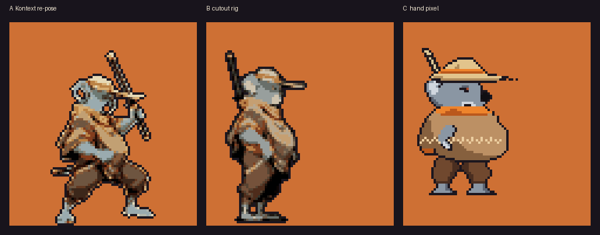
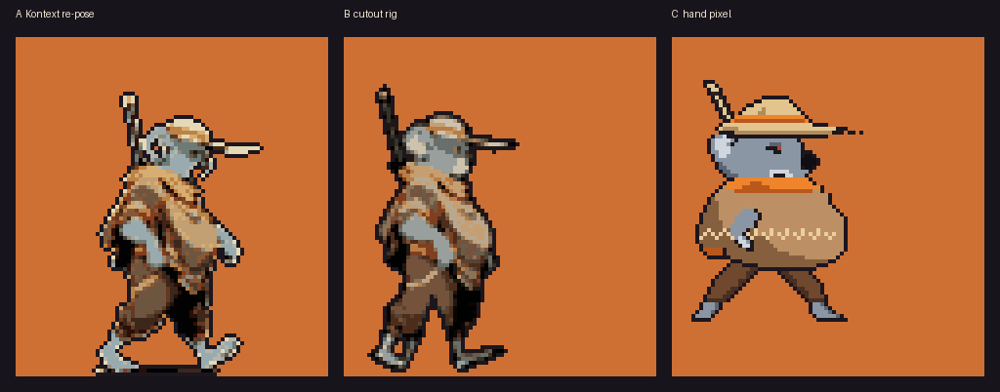
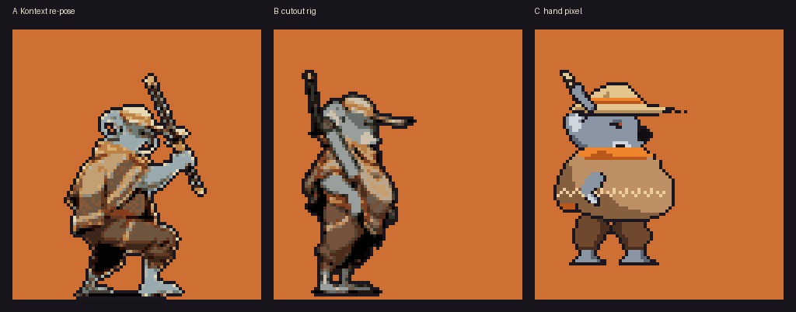
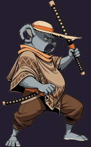
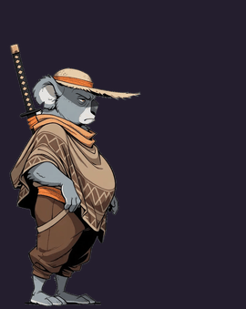
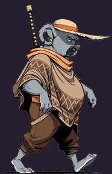
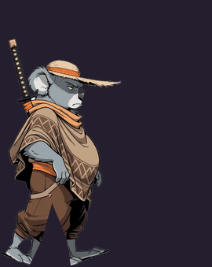
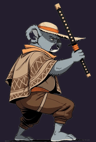
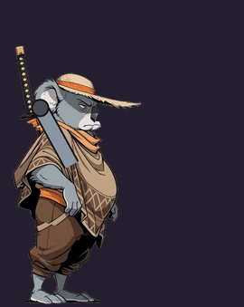

# t-007: sprite pipeline bake-off on Zuzu

2026-10-06 (PT). Zuzu's idle (4 frames), walk (6) and standing HP, the draw-cut (5), made three
ways from his reference build (A7, ArtImage 242193, mirrored to face right):

- **A, pose-locked generation.** Flux Kontext re-poses the reference into each frame, using one
  fixed seed. The backend has no pose ControlNet, so the pose is described in each frame's prompt
  (see kind-robots t-134).
- **B, cutout rig.** Parts are cut from the reference (head and kasa, poncho, two legs, the katana
  hilt) and posed in code at full resolution. The drawn blade and the sword arm are drawn in code.
- **C, hand pixel.** Indexed pixel maps typed by hand at game size: one body, plus a hand-drawn
  layer per frame for the legs or the sword arm.

All three go through the same final step, `tools/sprite_common.py`:
1. Key out the backdrop, including pockets trapped inside the figure.
2. Smooth with a mode filter, then scale down with Lanczos to Zuzu's 72 px.
3. Map every frame to one shared 16-colour palette.
4. Add a one-pixel outline outside the silhouette.

So the comparison is about drawing and motion, not the downscale. Everything regenerates from
`tools/` and `art/T007-METHOD-A.yaml`.

Silas's steer during the bake-off (2026-10-06, PT): *"pixel is a style choice, users should be able
to select pixel or hd or others if they are fun"*. That changes what this bake-off is for. The
question is no longer "which method makes the best 72 px sprite". It is "which method makes an art
master that serves every style". A and B both have a high-resolution source, so their HD style is
shown too.

## Pixel style (72 px, 16 colours, on the desert stage's dusk)

Idle, 8 fps:

Walk, 10 fps:

Standing HP, the draw-cut, 15 fps:

## HD style (288 px, the same frames before pixelizing)

| | A, Kontext re-pose | B, cutout rig |
|---|---|---|
| idle |  |  |
| walk |  |  |
| HP |  |  |

C has no HD style. It is pixel-native, so scaling it up only makes bigger pixels.

The 15 raw Kontext renders, before keying and mirroring, are in
[`t-007/a-raw-renders.jpg`](t-007/a-raw-renders.jpg).

## What each method got right and wrong

**A, Kontext re-pose.**
- The best drawing by far: on-model, in the house style, with a real fighting stance and his
  portly build intact.
- At HD it already looks like a commercial fighter.
- As animation it failed:
  - **It ignores direction.** All 15 frames came back facing left despite "facing right" and a
    mirrored source, so they are mirrored again afterwards (`post_mirror`).
  - **It can't hit a pose from words.** The six walk frames are nearly the same stride, so there is
    no cycle. The slash never happens: no frame has the arm extended at chest height.
  - **Props drift.** Within one seed the sheathed katana becomes a bare blade (idle 3) and a second
    sword appears at his waist (HP 2 to 4). The comic angle renders had the same problem.
  - **Size stays steady** (figure height 70.6 to 72.9 game px, stdev 0.8), so placement and
    scale hold up. It's the pose and the props that drift.

**B, cutout rig.**
- Exact control. Every frame is on-model because every part is the same pixels, and the HD
  style is free.
- But it looks like a paper puppet: he stays upright, feet slide, and the code-drawn sword arm
  reads as pasted on.
- Its limits come from the source. The reference has one arm and one stance, so the rig can
  only bend what it was given. Rigs need art drawn in separable parts: each limb whole, the
  weapon on its own.

**C, hand pixel.**
- The best read at 72 px: a clean, iconic silhouette, clear colour blocks, and a walk with real
  leg phases.
- The slash smear is the kind of effect that only hand pixels do well.
- But it is less on-model (rounder, simpler, the face reduced to a few pixels), pixel-only, and
  every new pose is more typing.

## Cost per frame

| | setup | per frame | usable frames here |
|---|---|---|---|
| A | one ledger: prompts, seed and source (`art/T007-METHOD-A.yaml`) | about 2.4 min of GPU time (mean 144 s, max 245 s); 15 frames took about 40 minutes through the shared queue | idle 2 of 4; walk 0 of 6 as a cycle; HP 0 of 5 as a slash |
| B | 5 part polygons, 3 pivots, about 180 lines of rig code | one line of pose numbers; about 4 s of CPU to render | 15 of 15 on-model, motion stiff |
| C | the body: about 1,400 hand-typed pixels | about 120 to 250 hand-typed pixels (3,275 in all) | 15 of 15, pixel style only |

## Recommendation

1. **HD masters are the source of truth, and pixel is derived.** Every fighter's art is authored
   and stored at HD. The pixel style is produced by `sprite_common`'s pixelize step, not drawn
   separately, so pixel, HD and any later style (CRT, painterly) share one set of poses and boxes.
   The resolution and style switch itself is kr-arcade t-012, with zuzu-showdown t-027 to adopt
   it.
2. **For fighters, A's art drives B's motion.** Use the house lane (Kontext from the locked angle
   sets) to generate each fighter's parts sheet: the turnaround, then each limb, the torso, the
   head and the weapon drawn separately on a flat backdrop, plus a few key poses as rig
   references. The rig (B) animates those parts at HD.
   - This keeps A's quality and B's exactness, and is the only one of the three that delivers
     both styles.
   - The task note's default was "A for fighters". The evidence says A's frames can't be the
     animation, only its art.
3. **Full-frame A comes back when kind-robots t-134 (the pose ControlNet lane) lands.** The rig
   already produces exact skeletons, so it can feed them to the ControlNet. Re-test A for the
   poses a rig handles badly: turns, crouches and big squash-and-stretch.
4. **For effects, C** (as the note said): smears, hit sparks, dust and the Showdown eye strip,
   hand-pixelled for the pixel style, with an HD counterpart drawn for the HD style.
5. **The first art slice (t-010) changes accordingly.** Zuzu and the Coyote each get:
   - HD parts sheets;
   - a rig per fighter;
   - pixel and HD atlases exported from the rig;
   - hitboxes authored once against the HD frames and scaled for the pixel ones.

Per the task's default-recommendation rule, this was shown to Silas on 2026-10-06 (PT). If he
doesn't answer, the recommendation stands on 2026-10-13.
